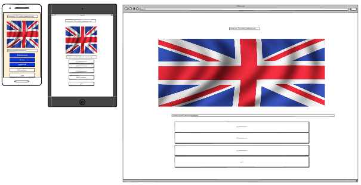

# ReadME - Project Instruction
Portfolio Project 2 – User SureDeveloping – Code Institute
## Contents
[Contents](#contents) \
[User experience (UX)](#user-experience)\
[Target audience of the website](#target-audience-of-the-website)\
[User story](#user-story)\
[Design](#design) \
[Color scheme](#color-scheme) \
[Typography](#typography) \
[Imagery](#imagery) \
[Wireframe](#wireframe) \
[Features](#features) \
[Accessibility](#accessibility) \
[Technologies used](#technologies-used) \
[Software and frameworks used](#software-and-frameworks-used) \
[Languages used](#languages-used) \
[Deployment](#deployment) \
[Testing](#testing) \
[Manual testing](#manual-testing) \
[Chrome developer tools](#chrome-developer-tools) \
[Slack peer group rewiew](#slack-peer-group-rewiew) \
[Validator tests](#validator-tests) \
[Solved bugs](#solved-bugs) \
[Known unsolved bugs](#known-unsolved-bugs) \
[Credits](#credits) \
[Code used](#code-used) \
[Content on the website](#content-on-the-website) \
[Learning materials](#learning-materials) \
[Acknowledgments](#acknowledgments)
## User experience (UX)
### Target audience of the website
- People who like browser games.
- People who want to learn about the countries and their flags.
- People who want to pass some free time.
### User story
As a first time user of the website, you want to:
- play a bug-free game.
- play a self-explanatory game.
- be able to navigate the site intuitively.
- know the rules of the game and how to play it.
- find a scorepoint display on the site.
- have a resolution of the question displayed.
- be able to use the website from any device.
- lern which country has which flag.

As a frequent user of the website, you want to:
- repeat the game experience.
- improve and learn more about the countries and their flags.
- have randomly mixed questions or flags, so you don't know the order.

Objective of the website operator is to:
- provide an easy to navigate website.
- provide an entertaining diversion to pass the time.
- provide a way to learn about different countries and their flags.
- provide accessibility for screen readers through aria labels.

How this requirements are met:
- The game will be free to play.
- Aria labels, alt text and semantic elements will be used.
- Sans-serif font are used.
- All important elements can be found on the main page without having to navigate a lot.
- There is always the possibility to quit the game.
- There is the possibility to skip a question. 
- There is a link to the rules of the game.
## Design
### Color scheme
I used the website https://coolors.co/ to find colors that go together. They should be bright and friendly.

Finally, I checked the contrast again with the page https://contrast-grid.eightshapes.com/

### Typography
The fonts come from googlefonds and were used for the following fonts:
- Rampart One is used for the main headline "The flag Quiz". It is a sans-serif font.
- Lexend is used for all other text on the site. It is a sans-serif font.
### Imagery
Images used are from the site https://www.freepik.com/.  
Main image is designed by Ibrandify / Freepik.  
The other images are designed by Allexxandar / Freepik.
### Wireframe
Wireframe screenshot for the start page:

Wireframe screenshot for rules page:

Wireframe screenshot for game page:

### Features
The website is a Flag Quiz. Visitors can test their knowledge of countries and their flags. There are 3 main pages. The landing page provides an overview of all the content on the site for the visitor. The second page is the "How to play" page, which explains the rules. The third page is the "Game" page where the quiz is played.

- Features of all pages:  
There is a headline on top of all pages, "The Flag Quiz". Furthermore there are buttons on all pages. Those buttons have all a hover and a pointer effect when you move your mouse over the button.

- Landing page:  
Below the headline there is a subheadline followed by a picture of the flags of the world. After that there are two buttons. The "How to play" button opens by clicking the "How to play" page which is showing the rules of the game and the second button, "Start the Quiz" starts the game. 

- "How to Play, rules" page:  
Underneath the headline you can find a subheadline and a text which describes how the game can be played. Below this text there are two clickable buttons. By clicking on the first one, "Close" button you get back to the index.html page. A click on the second button, "Start the Quiz" button will start the game.

- Game Page: 
Under the headline of the game page you find the score counter. This is automatically counted up if the answer is correct. Below the score counter is the question "Which country has this flag?" followed by alternating flags, currently 23 that can be guessed. Under the flags there are 3 answer buttons, each with one possible answer. Finally, there are 2 more buttons. The first allows the user to skip a flag, "Skip Flag" button. The second button, "Quit" can be used to stop the game at any time and return to the start page.

A correct answer is highlighted with color in the answer button.

If the player answers incorrectly, the correct answer is shown so that the player can learn what the correct answer would have been.

After the last flag, the player is shown this as a message. He is asked whether he would like to play again or would rather stop. By clicking the "Quit" button, the player returns to the Index.html page. If the "Play Again" button is clicked, the game starts again.

- Future Implementations:
  - I would randomize the wrong answers for more variety. Now the same answers are always in the same position for each flag. Shuffling would provide more variety.
  - In addition to the signaling of the correct and incorrect answer by the colors in the button, an additional signal tone could be played for correct and incorrect.
  - The whole game can be expanded with more flags. These could then be divided up according to regions in the world, for example according to continents. In this way, the difficulty of the game can be adjusted and the countries of a region can be learned specifically.
  - The game could also be expanded with other things by which you have to recognize a country. For example, the outline of a country's borders on the map or the national anthem are possible.
  - I could also add a highscoure board where players can register and save there scoure points.
### Accessibility
To ensure Accessibility the following things were done:
- I used semantic HTML.
- I used descriptive alt attributes for images.
- I provided information for screen readers.
- I used good color contrast and a tested color palette.
## Technologies used
### Languages used
HTML, CSS and Java Script were used for this project.
### Software used
Balsamiq - To create a wireframe.  
Gitpod - To code the website.  
Git - For version control.  
Github - To store and deploy the website.  
Google Fonts - All fonts used are from google fonts.  
gauger.io/fonticon - To create a favicon.  
Google Dev Tools, and Lighthouse - For troubleshooting testing and fixing bugs.  
Deepl - For translating text.  
Birme - To change the image to webp format and reducing the size of the images.  
Am I Responsive? - To check if the page is responsive.  
## Deployment
The project was coded with gipod and then deployed on Github. That is how the deployment was done:
- I logged in at GitHub and navtigate to the repo of the project
- I clicked on "Settings" and navigated to "Github pages"
- There I seted the source of Deploy from a branch and set the branch from none to main and clicked save.
- Then this link was deployed automatically: https://suredeveloping.github.io/flag-quiz/
## Testing
The page was tested on different ways and different errors came to light.
### Manual testing
I tested all the buttons by clicking on them and playing the game several times. This was done during the hole prozess while creating this project and especially at the end. A detailed description of the bugs can be found in solved and unsolved bugs.
### Chrome developer tools
- I used Def-tolls to check if the side is working on different screen sizes.
- I used Lighthouse to test my webside.
Result of the Lighthouse test for the index.html:

 

Result of the Lighthouse test for the rules.html:

 

Result of the Lighthouse test for the games.html.
I was able to improve the performance by optimizing the images data size. You can see that there are differences depending on which image is loaded. To increase the performance even further, other images or even especially created images could be used to reduce the data size. 

 
### Slack peer groupe rewiew
James Evans has tested my game and noticed that everything is running well. He also discovered a spelling mistake which I have corrected. 
### Validator tests
HTML 
The test result from the W3 validator test for the index.html:

The test result from the W3 validator test for the rules.html:

The test result from the W3 validator test for the game.html:

Css 
The test result from the W3 css validator test:

JS 
The test result from JSHint for the index.js:

The test result from JSHint for the rules.js:

The test result from JSHint for the script.js:

The test result of "Am I Responsive?":

### Solved bugs
- After I clicked the start quiz button the games.html opened but the flags and answers were not loaded. I had the assumption that it is the browser that has to load the page first before it can load the functions for the flag and for the answers. So I first tried to solve this problem with setTimeout() and with a callback function. Waiting for the DOM was not successful either. The solution was it to call the function in the Js below the code and use the button only to open the games.html. Previously I had called the function with the button. The startQuiz function then started the game.html and fired function for the flags and answers.
- I had a problem that the correct answers were not displayed as correct. This had to do with the position of the if method that increments the flag number. The incrementing may only take place when an answer has been submitted by the player. If the incrementing is done earlier, the check answer function picks up the wrong values from the flags array.
- I had in the index.html values for the height and the width when img are not allowed. This was the result of a W3validator check. Therefore these were changed.
- I had an empty src value in the img placeholder on the game.html page. This was also a result of the W3validator check. The value was therefore set to 0.
- I had an error in the console. I only had one JS file. Therefore, when opening the index.html an image was already tried to be loaded which is only visible on the game html page. This has caused an error. With the help of the tutor team I was able to fix the error by creating a separate Js file for each html file.
- I had an error in the console. A favicon could not be loaded. I recreated the icon and replaced the icon file.
- I had a mistake with my scr value for the placeholder of my flag images. When I left it blank in the html, I got an error in the W3 validator. If I simply inserted a placeholder I got an error in the console. The solution was to use a link to an existing image. This is later overwritten by Javascript. Therefore, the correct link at this point does not affect the game.
### Known unsolved bugs
- There are no known unsolved problems.
## Credits
### Code used
- I used the Asterisk wildcard selector from the Love running project.
- The shuffleFlags function is adapted from a Youtube video https://www.youtube.com/watch?v=Gfx9UV2tpLg.
- I have informed and inspired myself about some functions in Youtube tutorials. The videos I watched are listed under Learning materials.
### Content on the website
The content of this project was written by Stephan Sure.
### Learning materials
- All content from nnline course in "Full Stack Software Developmen" especially videos about Portfolio Project 2 and ReadME from Code Instituet
- https://www.youtube.com/watch?v=40vLxYUJiQY&list=PL_7334VduOHvzZYlgy_0kZLcic2NINCUt&index=6 - Video about the Profolio Project 2
- https://www.youtube.com/watch?v=U9VF-4euyRo&t=831s - Video about css and clamp function
- https://www.youtube.com/watch?v=eHPLTDOAggc - To lern how to make the buttons work
- https://www.youtube.com/watch?v=riDzcEQbX6k - How to bulid a quizz with java script
- https://www.youtube.com/playlist?list=PLB6wlEeCDJ5Yyh6P2N6Q_9JijB6v4UejF  - How to bulid a quizz with java script
- https://www.youtube.com/watch?v=PBcqGxrr9g8 - How to bulid a quizz with java script
- https://developer.mozilla.org/en-US/docs/Web/API/setTimeout - Timeout function
- https://www.w3schools.com/jsref/event_onclick.asp  - To lern how to make the buttons work
- https://www.youtube.com/watch?v=xVMkFJZhZYU&t=283s - To lern how to make the buttons work
- https://werner-zenk.de/javascript/html-button_ueber_javascript_eine_funktion_zuweisen.php - To lern how to make the buttons work
- https://www.youtube.com/watch?v=P6UgYq3J3Qs - To learn more about position absolut and relative
- https://www.youtube.com/shorts/9cSL5dP4rgM - To learn more about position absolut and relative
- https://stackoverflow.com/
- https://www.w3schools.com/css/
- geekforgeeks
- W3Schools
### Acknowledgments
I like to thank the follow persons for the help during the project:
- My Code Institute mentor Spencer Barriball.
- The Tutor Support team at Code Institute.
- Slack pear groupe especially James Evans.
- All the people who make their knowledge available for free on YouTube.

**This project is for educational use only and was created for the Code Institute course Full stack software development by Stephan Sure.**